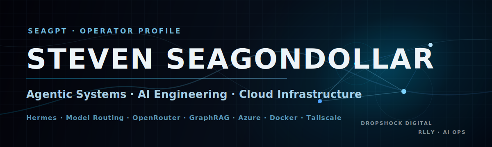
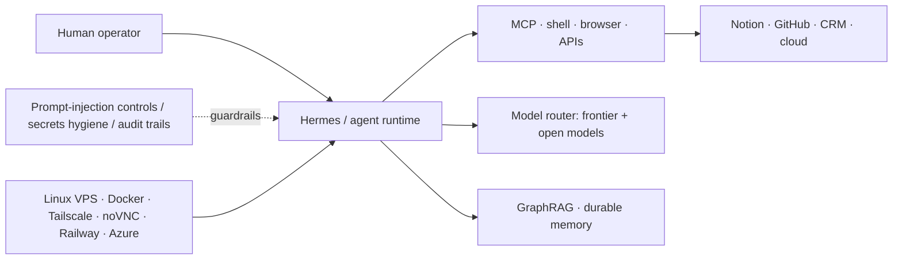

  

<h1 align="center">Steven Seagondollar</h1>

  <strong>Head of Agentic Systems & AI Engineer at Rlly</strong> 
  Founder of <strong>DropShock Digital</strong> · Hesperia, California

  <a href="https://www.stevenseagondollar.com/">Website</a> ·
  <a href="mailto:steven.seagondollar@dropshockdigital.com">Email</a> ·
  <a href="https://github.com/seagpt?tab=repositories">Repositories</a>

---

I build agentic systems that have somewhere real to run: model routing, durable memory, cloud desktops, workflow automation, and the security layer around all of it.

My work sits at the intersection of **AI engineering**, **cloud infrastructure**, **developer tooling**, and **operator-grade automation**. I care about systems that survive contact with the real world: rate limits, messy user context, bad inputs, cost ceilings, failing jobs, and humans who need proof before they trust an agent.

## What I’m focused on

- **Agentic infrastructure** — Hermes, PaperClip-style orchestration, OpenClaw/NemoClaw evaluations, autonomous worker patterns, and human approval loops.
- **Model routing** — using frontier models where judgment matters and cheaper/open models where throughput matters.
- **Cloud workstations** — always-on VPS/desktop environments, Tailscale-only access, Docker isolation, noVNC, and agent-accessible machines that keep working when laptops sleep.
- **AI memory + retrieval** — GraphRAG, bi-temporal memory, Notion/knowledge-base workflows, and source-grounded responses.
- **Secure AI operations** — prompt-injection awareness, input sanitization, secrets hygiene, evidence-first watchdogs, and fail-closed automation.
- **Client-ready software** — Vite/React sites, backend APIs, CRM/accounting integrations, and deployment pipelines that can be handed off without mystery.

## Public work

| Project | What it shows | Stack / domain |
|---|---|---|
| [Q-KVE Security Research](https://github.com/seagpt/qkve-whitepaper) | Security analysis of KV cache quantization as an attack surface, with responsible-disclosure posture. | LLM security · inference infrastructure · technical writing |
| [DropShock Digital V9](https://github.com/seagpt/dsd-website-v9) | Branded cinematic website build with a black-ice design system and no WebGL dependency. | Vite · React · GSAP · Lenis · CSS systems |

<strong>Private / client systems I can discuss at a high level</strong>

- Agent workstations and cloud desktops for AI-assisted team operations.
- Notion, Zoho, Gmail, Calendar, Slack, Discord, and Telegram automation pipelines.
- Website rebuilds and private-review deployments for professional-service clients.
- AI content/CMS workflows where agents can draft, update, and route human approval.
- Model evaluation, cost control, and routing through OpenRouter-style provider layers.

## Systems map

## Toolbox

| Lane | Tools and patterns |
|---|---|
| **AI / agents** | Hermes Agent, OpenClaw/NemoClaw evaluation, PaperClip-style orchestration, LangGraph, GraphRAG, MCP, OpenRouter, Claude/Codex/Copilot workflows |
| **Cloud / infrastructure** | Linux VPS, Docker, Tailscale, Railway, Azure Functions, Cosmos DB, noVNC, GitHub Actions, cron/watchdog jobs |
| **Frontend / product** | Vite, React, Tailwind, GSAP, Lenis, Three.js, Framer/CMS workflows, responsive QA, source-fidelity rebuilds |
| **Automation / data** | Notion API, Zoho Books/CRM, Gmail/Calendar, Slack/Discord/Telegram bots, webhooks, JSONL logs, scripted evidence collection |
| **Security / reliability** | Prompt-injection threat modeling, secrets handling, sandboxing, audit logs, fail-closed jobs, responsible-disclosure writing |

## Engineering stance

- **Evidence beats narration.** Logs, probes, diffs, screenshots, and test output come before confident prose.
- **Cost is architecture.** A good AI system routes work by judgment, context length, latency, and price — not by brand loyalty.
- **Agents need boundaries.** Useful autonomy still needs scope, permissions, rollback paths, and human approval at the right moments.
- **Source fidelity matters.** I’d rather ship a restrained system grounded in real requirements than a flashy interface full of invented proof.
- **Security is not a feature card.** It is how inputs, prompts, tools, credentials, memory, and deployment surfaces are designed.

## Learning track

I’m actively sharpening the cloud/AI certification path around Azure fundamentals, Azure administration, AI app/agent development, architecture, DevOps, and cloud/AI security. Prior credential work includes Google AI Essentials and technical-support foundations.

## Good conversations to start

- Building internal AI coworker infrastructure without runaway SaaS costs.
- Turning messy Notion/CRM/email data into useful agent context.
- Designing approval loops for autonomous coding, research, and admin agents.
- Cloud desktops and agent-accessible workstations for teams.
- Prompt-injection defense, input sanitization, and practical AI security controls.
- High-end developer-facing websites that do not look vibe-coded.

---

  <strong>Build the system. Prove it works. Keep it running.</strong>

